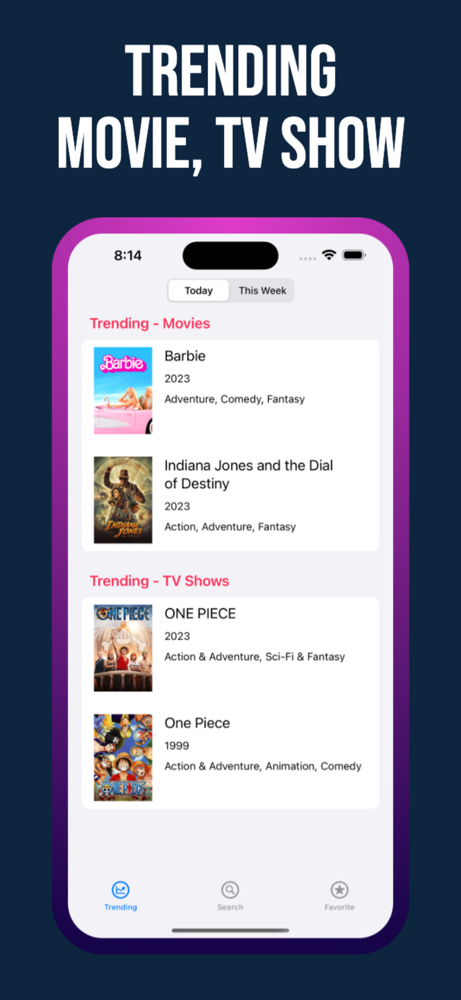
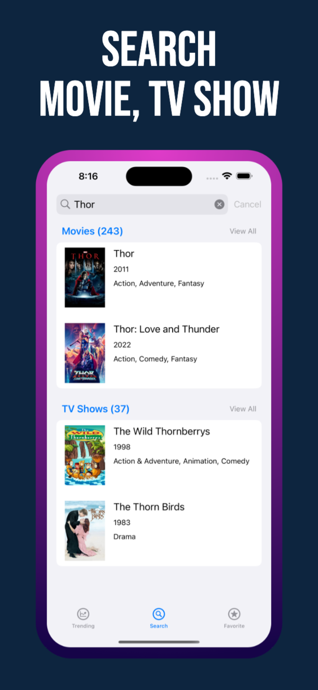
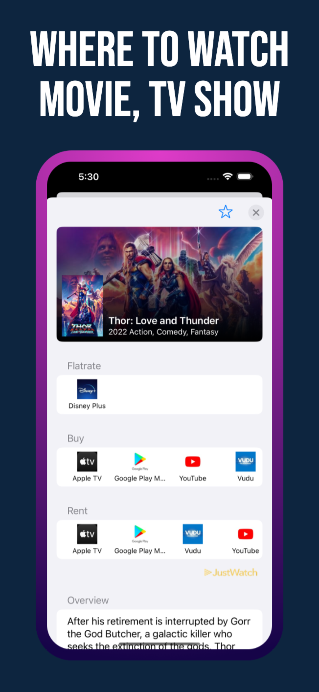
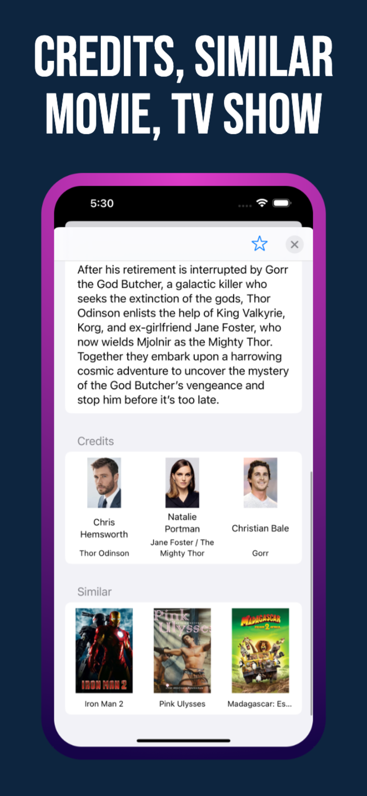
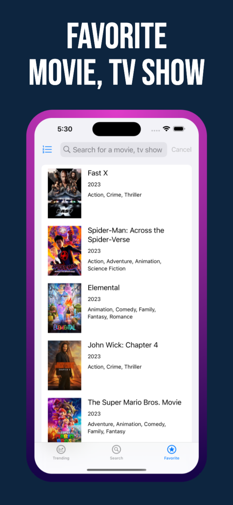
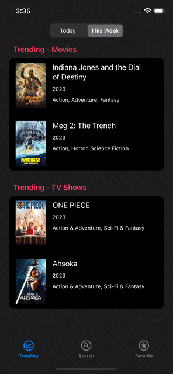
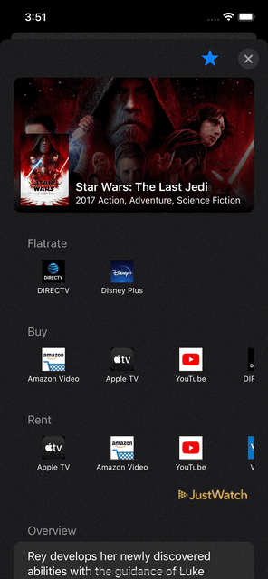

# Where To Watch

||||||
|:--:|:--:|:--:|:--:|:--:|

## 어디서 봐 Where To Watch

영화, TV 프로그램을 어디서 볼 수 있는지 검색하세요

* 오늘 / 이번 주 트렌딩 영화, TV 프로그램 조회.
* 영화, TV 프로그램을 검색.
* 영화, TV 프로그램을 어디서 볼 수 있는지 확인.
* 영화, TV 프로그램 출연진과 비슷한 콘텐츠 확인.
* 즐겨찾기 목록 관리.

### 개발 일정

|일정|설명|
|:--:|:--:|
|2023.05.15 ~ 2023.06.01|개발 시작 ~ 심사 제출|
|2023.06.23|1.0 버전 출시|
|2023.06.27|1.0.1 버전 출시|
|2023.08.09|1.0.2 버전 출시|
|2023.09.06|1.0.3 버전 출시|

### 팀원

||
|:--:|
|[이준호](https://github.com/junho15)|

### 개발환경

 

### 사용 기술 및 라이브러리

* Swift Concurrency.
* The Movie Database (TMDB) API.
* SwiftLint.

### 미리보기

|||||
|:--:|:--:|:--:|:--:|
|트렌딩 영화/TV 프로그램 조회|영화/TV 프로그램 검색|영화/TV 프로그램 정보 조회|즐겨찾기 목록 관리|
